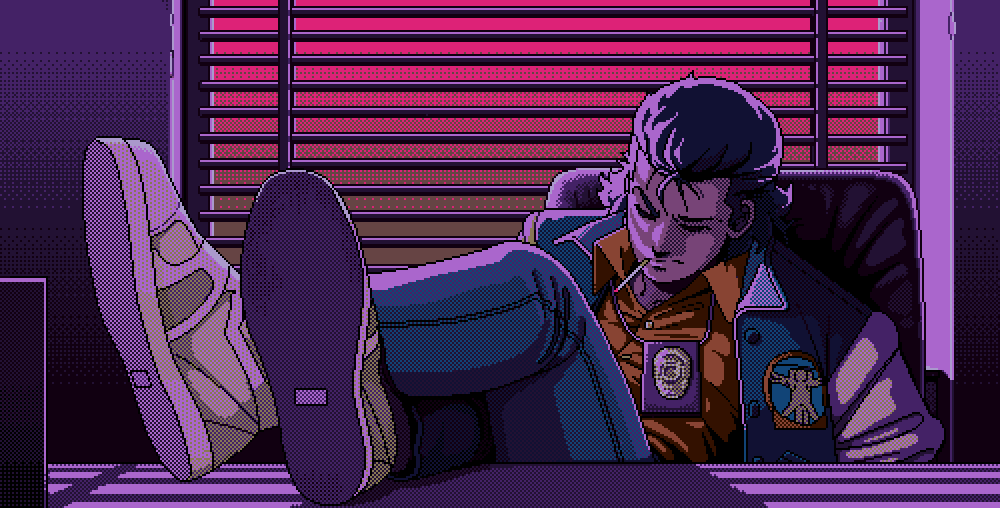
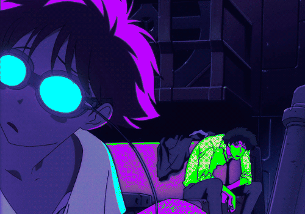

# Olá, sou Weslley Valério 👋

Bem-vindo ao meu perfil do GitHub! Sou um desenvolvedor apaixonado por tecnologia e sempre em busca de novos desafios. Aqui você encontrará alguns dos projetos nos quais trabalhei e as tecnologias que utilizei.

  

#

  Sou estudante de Ciências da Computação na Faculdade Descomplica EAD e tenho uma paixão por explorar o mundo da tecnologia.
   Atualmente, trabalho com C-sharp e estou mergulhando em livros para expandir ainda mais meus conhecimentos.
  

  A cada desafio que encontro, busco aprender mais e aplicar soluções criativas que tornem o mundo mais conectado e eficiente.

#

<h3 align="left">Connect with me!</h3>

<h3 align="left">My knowledgement and Tools~</h3>

  
  
  
  
  
  
  
  
  
  
  
  
  

#

  <h3> GitHub Stats </h3>
   
  

  

<picture align="center">
  <source media="(prefers-color-scheme: dark)" srcset="https://raw.githubusercontent.com/wes65656/wes65656/output/github-contribution-grid-snake-dark.svg">
  <source media="(prefers-color-scheme: light)" srcset="https://raw.githubusercontent.com/wes65656/wes65656/output/github-contribution-grid-snake-dark.svg">
  
</picture>
